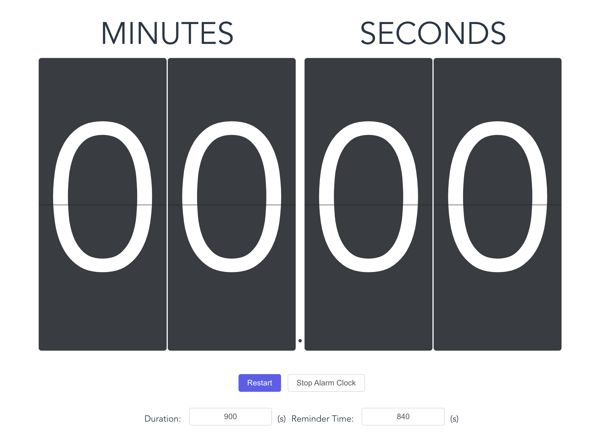

# Alarm Clock

This tool was developed during my tenure as a teaching assistant at the Hong Kong Polytechnic University, and it has been utilized for the COMP6703 and COMP5570 courses. In doctoral courses, a final assignment often involves students presenting a topic within a set time limit, such as 15 minutes. Managing presentation duration is crucial to ensure the smooth completion of the course schedule. Therefore, I developed this application to remind students of the remaining time or when time has run out during their presentations.

<div align="center">
    
</div>

## Deployment

### Installing Dependencies

To get started, install the necessary dependencies by running:

```bash
npm install
```

### Compiling and Minifying for Production

For production deployment, compile and minify the project using:

```bash
npm run build
```

## Usage

Navigate to the IP address: 8080, for example, http://localhost:8080/. You will see the following interface.

* Set the duration for the total length of the presentation, for example, 15 minutes * 60 = 900 seconds. Set a reminder time, such as at the 14th minute.

* Click Restart to begin the countdown. Click Stop Alarm Clock to stop the timer or the alarm sound.
* When the reminder time is reached, a "ding-dong" sound will play for about 1 second, designed to minimize disturbance. After the presentation time has elapsed, a gentle stop music will play for a longer duration.

## Development

### Compiling and Hot-Reloading for Development

For development purposes, compile and hot-reload the project using:

```bash
npm run serve -- --port 80
```

### Linting and Fixing Files

To lint and automatically fix files, run:

```bash
npm run lint --fix
```

## Dependencies

The application relies on the following key dependencies:

- core-js: "^3.8.3",
- element-plus: "^2.2.17",
- mitt: "^3.0.0",
- vue: "^3.2.13",
- vue-timer-hook: "^1.0.11"
